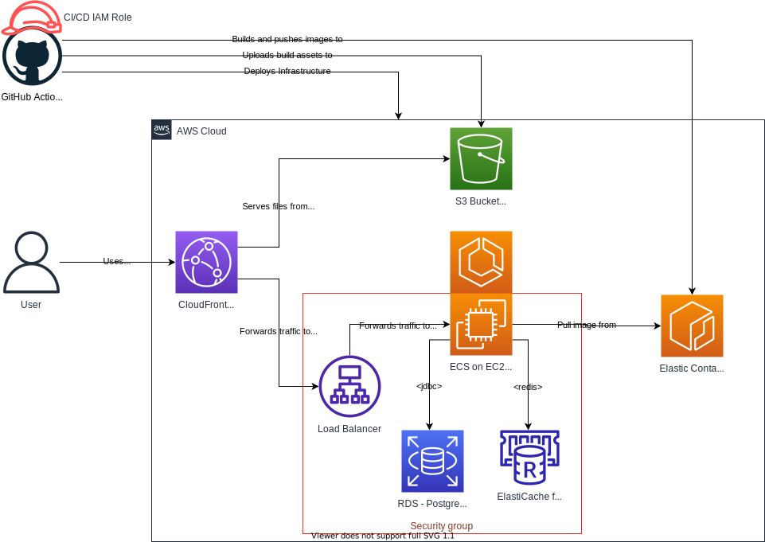

# Serverless frontend hosting

Goal: Reduce the load on the backend by hosting the frontend separately.

## Required Reading

- [Use CloudFront to serve a static website hosted on Amazon S3](https://aws.amazon.com/premiumsupport/knowledge-center/cloudfront-serve-static-website/)
- [Improve Your Architecture With Amazon CloudFront](https://catalog.us-east-1.prod.workshops.aws/workshops/4557215e-2a5c-4522-a69b-8d058aba088c/en-US)

## Online Shop

Set up the CDN infrastructure
- Create an S3 bucket and a CloudFront distribution for serving the UI via IaC.
- Set up the distribution to point the "default root object" to index.html (such that opening the root distribution url <https://dxyz.cloudfront.net>/ opens the index.html).
- Integrate the S3 bucket and the distribution via an S3 origin. 
- Use the origin in the distribution's default cache behavior.

Exposing the ALB through CloudFront
- Create another origin on the distribution, pointing to the ALB.
- Add cache behaviors to the distribution to forward all the traffic matching the `/login` and `/api/*` path patterns towards the ALB.

Publish the app to the CDN
- Adjust the CI/CD pipeline to:
  - Upload the built UI assets to the S3 bucket (hint: use "[aws s3 sync](https://awscli.amazonaws.com/v2/documentation/api/latest/reference/s3/sync.html)"),
  - Perform an invalidation on the CloudFront distribution (hint: use "[aws cloudfront create-invalidation](https://awscli.amazonaws.com/v2/documentation/api/latest/reference/cloudfront/create-invalidation.html)") to flush the CDN cache.
- Deploy. Open the app, show that it still works. Create an order and refresh the browser. You should get an error.
- Adjust the distribution such that 403 errors (like the one you got above) also return the index.html. 
- Deploy, open the app, show that it still works. Create an order and refresh the browser. You should not get an error anymore.

## Further Resources

- [Restricting access to an Amazon S3 origin - Amazon CloudFront](https://docs.aws.amazon.com/AmazonCloudFront/latest/DeveloperGuide/private-content-restricting-access-to-s3.html)
- [Specifying a default root object - Amazon CloudFront](https://docs.aws.amazon.com/AmazonCloudFront/latest/DeveloperGuide/DefaultRootObject.html)
- [How to Preserve SPA route path in the browser using AWS CloudFront](https://dev.to/aws-builders/how-to-preserve-spa-route-path-in-the-browser-using-aws-cloudfront-oai)
- [Using various origins with CloudFront distributions](https://docs.aws.amazon.com/AmazonCloudFront/latest/DeveloperGuide/DownloadDistS3AndCustomOrigins.html#concept_elb_origin)
- [Creating a CloudFront Distribution for Amazon EC2 and ALB](https://www.stormit.cloud/blog/cloudfront-distribution-for-amazon-ec2-alb/)
- [Invalidating files - Amazon CloudFront](https://docs.aws.amazon.com/AmazonCloudFront/latest/DeveloperGuide/Invalidation.html)
