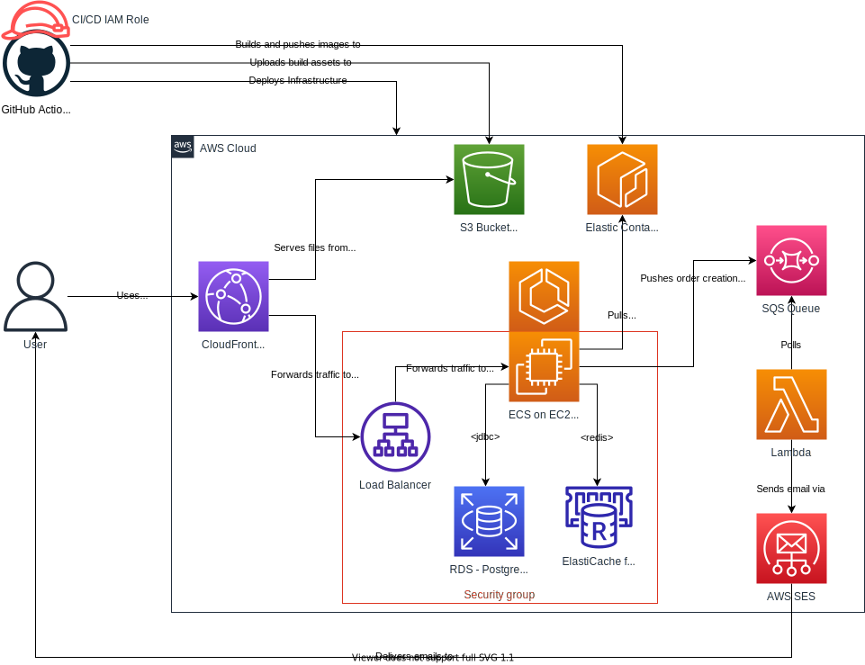

# Functions-as-a-service

Goal: Extend the application functionality by introducing a Lambda-based worker that reliably processes orders and sends emails.

## Required Reading

- [What is AWS Lambda? - AWS Lambda (amazon.com)](https://docs.aws.amazon.com/lambda/latest/dg/welcome.html)
- [Basic Amazon SQS architecture - Amazon Simple Queue Service](https://docs.aws.amazon.com/AWSSimpleQueueService/latest/SQSDeveloperGuide/sqs-basic-architecture.html)
- [Creating and verifying identities in Amazon SES - Amazon Simple Email Service](https://docs.aws.amazon.com/ses/latest/dg/creating-identities.html)

## Online Shop

Publishing orders to a queue
 - Create a new SQS queue via IaC.
 - Grant permissions to the backend to publish messages to this queue via IaC (via the [taskRole](https://docs.aws.amazon.com/AmazonECS/latest/developerguide/task-iam-roles.html) in the ECS task definition).
 - Adjust the backend to publish messages to this queue after receiving an order.

Processing orders through a Lambda
 - Create a new Lambda via IaC.
 - Have the Lambda consume messages from SQS.
 - Write a small snippet of code that just logs the received messages in the Lambda.
 - Deploy. 
 - Open the app, check that it still works. 
 - Create an order. 
 - Check that the Lambda was invoked with the order details.

Sending emails
 - Verify a couple of email address with Amazon SES (e.g. your work email + your personal email). 
 - Grant the Lambda privileges to send emails through SES via IaC.
 - Add two environment variables to the Lambda: "TO_EMAIL_ADDRESS" and "FROM_EMAIL_ADDRESS". 
 - Adjust the Lambda code to send an email to a fixed email address (e.g. the store owner) whenever the Lambda receives an order over SQS. Use these values from the env vars above for the from/to fields.
 - Deploy. Open the app, check that it still works. 
 - Create an order. Check that the SQS message was sent, the Lambda was invoked and the Lambda sent an email to your address.

Further Resources:

- [Using Lambda with Amazon SQS - AWS Lambda](https://docs.aws.amazon.com/lambda/latest/dg/with-sqs.html)
- [How do I send email using Lambda and Amazon SES?](https://aws.amazon.com/premiumsupport/knowledge-center/lambda-send-email-ses/)
- [Sending, receiving, and deleting Amazon Simple Queue Service messages - AWS SDK for Java 2.x](https://docs.aws.amazon.com/sdk-for-java/latest/developer-guide/examples-sqs-messages.html)
